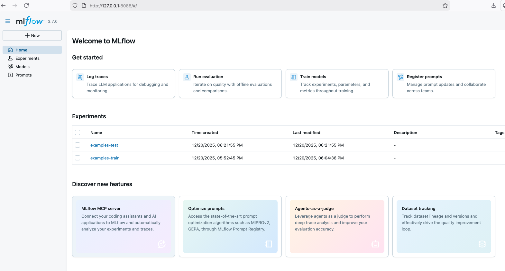

# Machine-Learned PIC Collision Operators

This repository provides a differentiable simulator framework implemented in PyTorch
to learn collision operators from plasma phase space dynamics.

This framework has been used to study collision operators from Particle-in-Cell (PIC) simulations in:
> [**Learning collision operators from plasma phase space data using differentiable simulators**](https://arxiv.org/abs/2601.10885)  
> *Diogo D. Carvalho, Pablo J. Bilbao, Warren B. Mori, Luis O. Silva, E. Paulo Alves*  
> 
> [**Learning time-dependent and integro-differential collision operators from plasma phase space data using differentiable simulators**](https://iopscience.iop.org/article/10.1088/1361-6587/ae5a1c)  
> *Diogo D. Carvalho, Luis O. Silva, E. Paulo Alves*

---

## Installation

### Optional
Create a virtual environment to avoid clashes with other environments

```
python3 -m venv .venv
```

And activate it to ensure packages will be installed under it

```
source .venv/bin/activate
```

### Mandatory

First, clone the repository

```
git clone git@github.com:diogodcarvalho/ml-pic-collision-operators.git
cd ml-pic-collision-operators
```

On `rigel`, to install the package dependencies with the correct PyTorch GPU version, you simply run:

```
pip install -r requirements/rigel.txt
```

On a different machine (e.g., your laptop), you can still just run:

```
pip install -e .
```

And it will download the standard CPU or default CUDA version of Torch from the regular Python repository (PyPI).

You can check that PyTorch is correctly installed and using CPU/GPU with 

```
python3 check_torch.py
```

## Quickstart

### Training / Testing Models

To train/test models, one runs in the terminal a command in the form:

```
mlpic_run <config_file.yaml> <experiment_name> <run_name> <mlflow_dir>
```

where:
- `config_file.yaml`: is a configuration file
- `experiment_name`: the name of the experiment to associate this run in MLflow
- `run_name`: the name of this particular run
- `mflow_dir`: the directory where MLflow is logging the files to

A few examples of configuration files to train/test different models are provided in `examples/`
together with an example dataset (needs to be downloaded) and bash scripts, which further illustrate the command line interface.

You can quickly check that everything is working well by downloading the example dataset (10MB download, 500MB after unzip):

```
chmod +x ./examples/download_data.sh
./examples/download_data.sh
```

And running a particular train example with:

```
chmod +x ./examples/do-single-example.sh
./examples/do-single-example.sh <train_example_name>
```

where `<train_example_name>` should match the YAML file name.

Or by running all the serial examples at once with:

```
chmod +x ./examples/do-all.sh
./examples/do-all.sh
```

And for distributed training with:

```
chmod +x ./examples/do-all-ddp.sh
./examples/do-all-ddp.sh
```

### MLflow UI

The code logs all metrics / checkpoints / videos / figures / etc. to an MLflow server
(by default, a directory on your machine).

To access an interactive MLflow UI that shows the existing logged experiments, you need to do as follows.

First, you need to start an MLflow server on the machine where the data is stored with:

```
mlflow server --host 127.0.0.1 --port 8088 \
  --backend-store-uri file:/path/to/mlruns \
  --default-artifact-root file:/path/to/mlruns &
```

If you are using VSCode, you should be able to immediately open `http://localhost:8088` in your browser 
and see the MLflow UI.

If you are running the code in a remote machine and not using VSCode, you probably need to do a bit of 
extra work to access MLflow UI.

First, you need to include an extra option when you ssh into the remote machine as follows:

```
ssh -L <local_port>:localhost:<remote_port> <user>@<remote_server>
```

where `<remote_port>` corresponds to the same port you started the mflow server in the remote machine (in this example `8088`) 
and `<local_port>` is the port in your local machine where you want to make MLflow UI available (can be the same value).

You can then access the MLflow UI in your browser by accessing `http://localhost:<local_port>`.

You should then see an interface similar to the one below with your experiments.

<p align="center">
  
</p>

